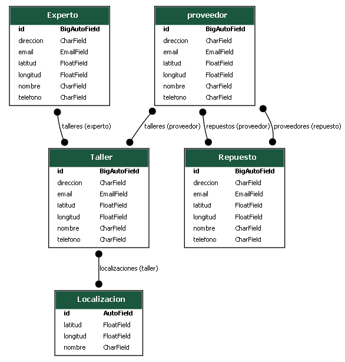

# PG2_PRACTICA3

## API de Localización de Talleres de Chapa y Pintura, Expertos en Vehículos y Proveedores de Repuestos
Esta API permite localizar, consultar y administrar información sobre talleres especializados en chapa y pintura, expertos en tipos específicos de vehículos (como clásicos, eléctricos, 4x4, etc.) Y proveedores de repuestos automotrices, facilitando la conexión entre usuarios que necesitan servicios específicos y los profesionales más adecuados cerca de su ubicación.

La API también gestiona información sobre proveedores de repuestos automotrices, permitiendo localizar distribuidores por cercanía, tipo de repuesto o marca.


## ¿Qué hace esta API?

Localiza talleres cercanos a una ubicación dada, permitiendo filtrar por especialidades y tipos de vehículo.

Permite buscar expertos en categorías específicas de vehículos, con información de experiencia, ubicación y especialidad.

Muestra detalles completos de cada taller o experto: ubicación exacta, contacto, servicios, tipos de vehículos atendidos, valoración y más.

Incluye proveedores de repuestos, permitiendo consultar disponibilidad, marcas, tipos de repuestos y ubicación de los distribuidores y precios.

Preparada para integrarse en sistemas móviles, apps web, o paneles administrativos.

## Diagrama de modelos 



## Crear entorno virtual

```bash
python -m venv env
```
## Crear un archivo 
```bash
.gitignore
```
## Activar entorno virtual

```bash
# Windows
.\env\Scripts\activate

# Linux
source env/bin/activate
```
* Problemas de activacion 

    Windows PowerShel
```bash
Set-ExecutionPolicy Unrestricted
```

## Instalar dependencias

* antes crear un archivo "requirements.txt" y escribir la version.

```python
django == 5.2
django-extensions == 4.1
djangorestframework == 3.16.0
 ```

```bash
pip install -r requirements.txt 
```
# Crea el proyecto api Django

```bash
django-admin startproject apichapapintura
```

# luego iniciamos la api

```bash
python manage.py startapp localizacion
```

agregamos en la api "apichapapintura" buscamos el archivo "settings.py" y agregamos.

```bash
INSTALLED_APPS = [
    'django.contrib.admin',
    'django.contrib.auth',
    'django.contrib.contenttypes',
    'django.contrib.sessions',
    'django.contrib.messages',
    'django.contrib.staticfiles',
    'django_extensions',
    "rest_framework",
    'localizacion',
]

GRAPH_MODELS = {
    'app_labels': ['localizacion'],
```

dentro del archivo "localizacion", buscamos un archivo "models.py" y ponemos las entidades de nuestra Api, atributos y relaciones

# Ejemplo del archivo models
```python

class Localizacionuser(models.Model):
    id = models.AutoField(primary_key=True)
    nombre = models.CharField(max_length=100)
    latitud = models.FloatField()
    longitud = models.FloatField()

class Taller(models.Model):
    id = models.AutoField(primary_key=True)
    nombre = models.CharField(max_length=100)
    direccion = models.CharField(max_length=255)
    telefono = models.CharField(max_length=15)
    email = models.EmailField()
    descripcion = models.TextField(default="Sin descripción") 
    latitud = models.FloatField()
    longitud = models.FloatField()
    localizaciones = models.ManyToManyField(Localizacionuser) 

class Experto(models.Model):
    nombre = models.CharField(max_length=100)
    direccion = models.CharField(max_length=255)
    telefono = models.CharField(max_length=15)
    email = models.EmailField()
    descripcion = models.TextField(default="Sin descripción") 
    latitud = models.FloatField()
    longitud = models.FloatField()
    talleres = models.ManyToManyField(Taller) 

class proveedor(models.Model):
    id = models.AutoField(primary_key=True)
    nombre = models.CharField(max_length=100)
    direccion = models.CharField(max_length=255)
    telefono = models.CharField(max_length=15)
    email = models.EmailField()
    latitud = models.FloatField()
    longitud = models.FloatField()
    talleres = models.ManyToManyField(Taller) 
    repuestos = models.ManyToManyField('Repuesto') 
class Repuesto(models.Model):
    id = models.AutoField(primary_key=True)
    nombre = models.CharField(max_length=100)
    modelo = models.CharField(max_length=255)
    precio = models.CharField(max_length=15)
    descripcion = models.TextField(default="Sin descripción")  
    proveedores = models.ManyToManyField(proveedor) 

   

```


luego instalar algunas dependencias para que pueda graficar el diagrama 

# Instalar dependencias
```bash
pip install django == 5.2
pip install django-extensions == 4.1
pip install djangorestframework == 3.16.0
pip install pydotplus
pip install django_extensions 
pip install graphviz

```

## Ejecutar el comando para el grafico
```bash
python manage.py graph_models ruta -o diagrama.png
```


## Referencia de Endpoints Públicos

* Todos los servicios de la API están disponibles públicamente. Se accede a ellos mediante el prefijo /api/, y no se requiere autenticación  para realizar operaciones CRUD (Crear, Leer, Actualizar, Eliminar)

```bash
Localización	/api/localizaciones/     GET, POST	    Listar o registrar ubicaciones de usuarios
Taller	        /api/talleres/	         GET, POST	    Listar o registrar talleres automotrices
Taller	        /api/talleres/<id>/	     GET, PUT, DELETE	Consultar, actualizar o eliminar un taller específico
Experto	        /api/experto/	         GET, POST	    Listar o registrar expertos en tipos de vehículos
Experto     	/api/experto/<id>/	     GET, PUT, DELETE	Consultar, actualizar o eliminar un experto específico
Proveedor   	/api/proveedor/	         GET, POST	    Listar o registrar proveedores de repuestos automotrices
Proveedor	    /api/proveedor/<id>/	 GET, PUT, DELETE	Consultar, actualizar o eliminar un proveedor específico
Repuesto	    /api/repuesto/	         GET, POST	    Listar o registrar repuestos automotrices
Repuesto	    /api/repuesto/<id>/	     GET, PUT, DELETE	Consultar, actualizar o eliminar un repuesto específico


```

## 1. Localización de Usuarios (/api/localizacionusers/)

Registrar ubicaciones de usuarios que buscan servicio

Ejemplo:
```bash

POST /api/localizacionusers/
{
  "nombre": "Mi ubicación",
  "latitud": -34.6037,
  "longitud": -58.3816
}

```

## 2. Talleres (/api/talleres/)
Talleres de chapa y pintura registrados.

Descripción: Lista todos los talleres.

Ejemplo:
```bash
GET /api/talleres/
{
  "nombre": "Taller Rápido",
  "direccion": "Av. Libertador 123",
  "telefono": "123456789",
  "email": "contacto@rapido.com",
  "latitud": -34.60,
  "longitud": -58.38,
  "localizaciones": [1]
}

```

## 3. Expertos (/api/expertos/)
Profesionales que trabajan con talleres.
Descripción: Lista todos los talleres.

Ejemplo:
```bash
GET /api/expertos/
{
  "nombre": "Juan Pérez",
  "direccion": "Calle Falsa 123",
  "telefono": "1122334455",
  "email": "juan@experto.com",
  "descripcion": "Especialista en pintura y abolladuras",
  "latitud": -34.59,
  "longitud": -58.39,
  "talleres": [1]
}

```

## 4. Proveedores (/api/proveedors/)
Proveedores de piezas para talleres.

Ejemplo:Lista todos los proveedores
```bash
GET /api/proveedors/
{
  "nombre": "Repuestera S.A.",
  "direccion": "Ruta 3 km 5",
  "telefono": "1167891234",
  "email": "ventas@repuestera.com",
  "latitud": -34.61,
  "longitud": -58.41,
  "talleres": [1],
  "repuestos": [1]
}

```

## 5. Repuestos (/api/repuestos/)
Piezas y componentes utilizados en los servicios.

Ejemplo:
```bash
GET /api/repuestos/
{
  "nombre": "Capot",
  "modelo": "Volkswagen Gol 2020",
  "precio": "30000",
  "descripcion": "Capot original pintado",
  "proveedores": []
}

```


* Esta API permite a las aplicaciones externas no solo cargar la información de talleres de chapa y pintura, expertos en vehículos y proveedores de repuestos utilizando los endpoints POST, sino también realizar búsquedas y filtrados avanzados mediante los endpoints GET. Esto habilita la creación de herramientas complejas, como un buscador de talleres por ubicación o un sistema para encontrar repuestos específicos para un modelo de vehículo.


